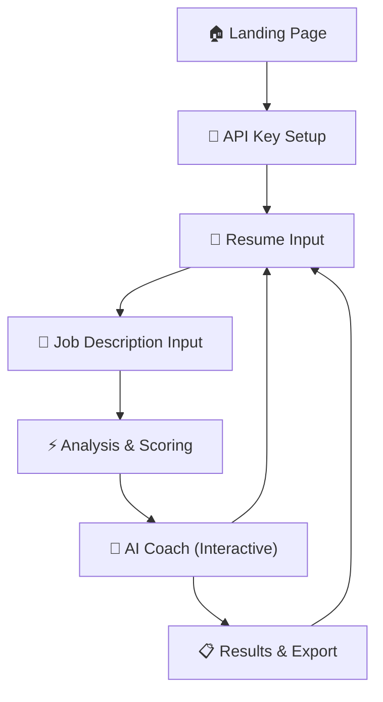

# ResumeAI Pro — AI-Powered Resume Assistant

## Product Overview

**ResumeAI Pro** is a premium, client-side AI resume assistant that coaches users through building ATS-optimized, high-impact resumes. It uses Google Gemini to analyze, score, and improve resumes — step by step.

**Target Users**: General industry professionals (job seekers, career changers, new grads)

**Core Value Proposition**: Get expert-level resume coaching powered by AI — no signup, no server, completely private.

---

## User Flow



**Guided journey**: Landing → API Key → Paste Resume → Paste Job Description → Get ATS Score + Analysis → Interactive AI Coaching → Export Improved Resume

---

## Tech Stack

| Layer | Technology | Rationale |
|-------|-----------|-----------|
| Build | **Vite** | Fast dev server, HMR, modern JS |
| Frontend | **Vanilla JS + CSS** | No framework overhead, full control |
| Styling | **Custom CSS** | Dark mode, glassmorphism, animations |
| AI | **Google Gemini API** (`@google/genai`) | Free tier, powerful, latest models |
| Architecture | **Client-side only** | No server costs, total privacy |
| Fonts | **Inter** (Google Fonts) | Clean, modern, professional |

> [!IMPORTANT]
> The API key is stored in `localStorage` and never leaves the browser. All AI calls go directly from the user's browser to Google's API. For production, this should be moved to a backend.

---

## UI/UX Design

### Design System
- **Theme**: Premium dark mode with glassmorphism
- **Primary**: `hsl(250, 80%, 65%)` (vibrant purple)
- **Accent**: `hsl(170, 75%, 55%)` (teal/cyan)
- **Background**: Deep navy with subtle gradients
- **Cards**: Frosted glass (`backdrop-filter: blur`)
- **Animations**: Smooth transitions, micro-interactions, pulse effects

### Screen Breakdown (7 Screens as Multi-Step Flow)

1. **Landing/Hero** — App intro, value proposition, "Get Started" CTA
2. **API Key Setup** — Simple input with validation, stored in localStorage
3. **Resume Input** — Large textarea with paste support + optional structured fields
4. **Job Description Input** — Paste target job posting
5. **Analysis Dashboard** — ATS score (circular gauge), keyword match, section-by-section breakdown
6. **AI Coach** — Chat-like interface for interactive resume improvements, before/after examples
7. **Results & Export** — Final improved resume, copy-to-clipboard, download as text

---

## Proposed Changes

### Project Structure

```
d:\AI\Resume Building Project\
├── index.html              # Main HTML (single page app)
├── package.json            # Vite + genai dependency
├── vite.config.js          # Vite configuration
├── src/
│   ├── main.js             # App entry point, router, state management
│   ├── styles/
│   │   ├── index.css       # Global styles, design tokens, animations
│   │   ├── components.css  # Component-specific styles
│   │   └── screens.css     # Screen layout styles
│   ├── screens/
│   │   ├── landing.js      # Landing page
│   │   ├── apiSetup.js     # API key configuration
│   │   ├── resumeInput.js  # Resume input form
│   │   ├── jobInput.js     # Job description input
│   │   ├── analysis.js     # ATS scoring dashboard
│   │   ├── coach.js        # Interactive AI coaching
│   │   └── results.js      # Final results & export
│   ├── services/
│   │   ├── gemini.js       # Gemini API integration + prompt system
│   │   ├── parser.js       # Resume parsing utilities
│   │   ├── scorer.js       # ATS scoring algorithm
│   │   └── keywords.js     # Keyword extraction
│   ├── components/
│   │   ├── scoreGauge.js   # Circular score visualization
│   │   ├── beforeAfter.js  # Before/after comparison cards
│   │   ├── chatBubble.js   # Coach chat messages
│   │   └── navbar.js       # Navigation/progress bar
│   └── utils/
│       ├── storage.js      # localStorage helpers
│       └── helpers.js      # General utilities
```

---

### AI Prompt System (Core)

The prompt system is the heart of the application. It includes:

#### 1. Resume Analyzer Prompt
- Parses raw resume text into structured sections
- Identifies strengths and weaknesses
- Extracts skills, experience level, industry

#### 2. ATS Scorer Prompt  
- Compares resume against job description
- Identifies missing keywords
- Scores on: keyword match, formatting, impact, clarity, relevance

#### 3. Resume Coach Prompt
- Interactive, coaching-style conversation
- Suggests improved bullet points with action verbs
- Provides before/after transformations
- Uses critique → improve loop
- Asks follow-up questions for context

#### 4. Resume Improver Prompt
- Takes full resume + job description + analysis
- Outputs complete improved resume
- Preserves user's authentic experience while optimizing language

> [!NOTE]
> All prompts use structured JSON output for reliable parsing. The system prompt establishes the AI as a senior recruiter with ATS expertise.

---

## Example Transformations (Built Into App)

### Weak → Strong Bullet Points

| Before | After |
|--------|-------|
| "Responsible for managing a team" | "Led and mentored a cross-functional team of 8 engineers, delivering 3 major product launches on time and 15% under budget" |
| "Helped with marketing campaigns" | "Spearheaded 12 data-driven marketing campaigns that generated $2.4M in pipeline revenue and increased lead conversion by 34%" |
| "Did data analysis" | "Engineered automated data pipelines processing 500K+ daily records, reducing reporting time by 60% and enabling real-time executive decision-making" |

---

## Verification Plan

### Automated
- `npm run dev` — verify dev server starts
- `npm run build` — verify production build succeeds

### Manual/Browser Testing
- Test full user flow: Landing → API key → Resume → Job → Analysis → Coach → Results
- Verify API key validation with Gemini
- Test AI analysis with sample resume/job description
- Verify responsive design on mobile/tablet
- Test copy-to-clipboard and export functionality

---
